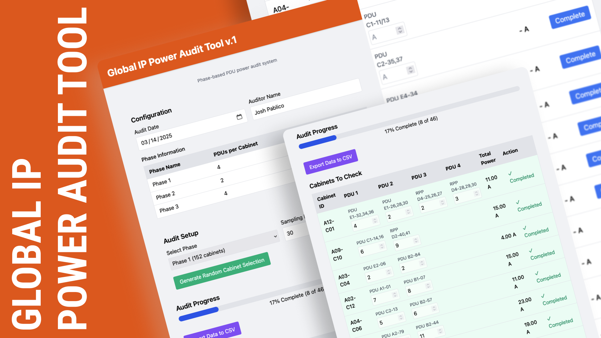

# Hi, I'm Josh Pablico

Data Center Technician | Aspiring Network Engineer | Automation-Oriented Builder

I'm currently a Data Center Technician at **Cloud Key**, where I focus on hardware provisioning, infrastructure uptime, and building internal tools that improve workflow efficiency. I also study networking (CCNA in progress) and spend time developing web tools and browser extensions that support data center operations.

---

## 🛠️ Featured Projects

### Power Audit Web Tool  
A React + Tailwind CSS tool for logging cabinet power usage with randomized sampling and CSV export functionality. Designed to improve data consistency and reduce manual entry effort.

[GitHub Repository](https://github.com/jpablico/GIP-Power-Audit)

### Ubersmith Auto-Ticket Closer  
A Chrome extension to assist with bulk alert management during mass failure events. Reduces closure time by streamlining ticket validation and handling.
[GitHub Repository](https://github.com/jpablico/Ubersmith-Alert-Helper-Extension)

---

## 📚 Currently Learning

- Cisco CCNA (Networking, VLANs, Subnetting, Routing)
- Golang (for backend scripting and CloudKey extensions)
- Docker and Proxmox (Homelab setup and automation)

---

## Contact

- [LinkedIn](www.linkedin.com/in/josh-pablico-618108220)
- 📫 jpablico27@gmail.com